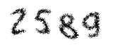

# TensorFlow.js Captcha Recognition

This project aims to train and use TensorFlow.js to perform captcha recognition in the browser.

## Table of Contents

- [Introduction](#introduction)
- [Usage](#usage)
- [License](#license)

## Introduction

In this project, we leverage the power of TensorFlow to train a machine learning model for captcha recognition. By using TensorFlow.js, we can perform captcha recognition directly in the browser without the need for server-side processing.

## Usage

Note: In this project, all captcha images are located in the `data` folder and are labeled by their filenames, with the following deformation characteristics:

1. The characters are surrounded by a lot of noise
1. The individual characters themselves are slightly distorted.

To implement the captcha recognition functionality in your browser, follow these steps:

1. prepare and label the captcha images for training
1. run `0-preprocess.py` to preprocess the captcha images
1. run `1-generate_dataset.py` to generate the dataset
1. run `2-train_model.py` to train the model
1. run `3-test_model.py` to test the model
1. run `4-convert_tfjs_model.py` to convert model for tensorflow.js

Now you have the model in the `web/tfjs_model` folder, start a server under the `web` directory, you can now perform captcha recognition in the browser.

## License

Distributed under the GPLv3+ License. See LICENSE for more information.
